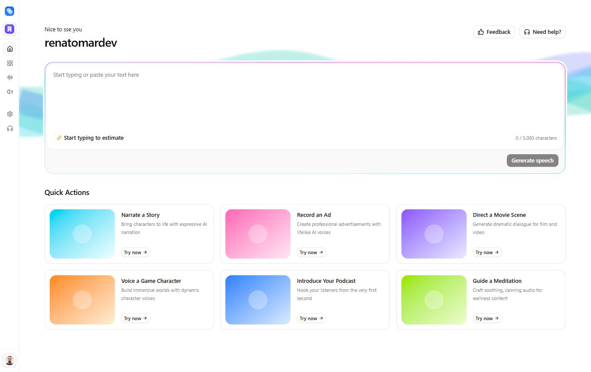
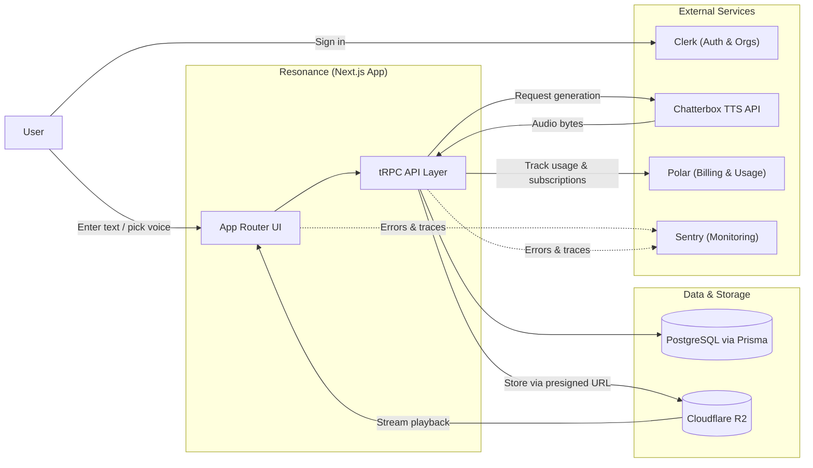

# Resonance

> AI-powered text-to-speech studio with multi-tenant organizations, voice cloning and usage-based billing.

    

Resonance is a full-stack, multi-tenant SaaS platform for AI-powered text-to-speech generation, built with Next.js 16 (App Router), React 19 and TypeScript. Users can turn text into natural-sounding speech using curated system voices or their own custom cloned voices, with per-organization usage tracking and metered billing.

## Preview



The dashboard lets users jump straight into generating speech from text, with curated quick-start templates for common use cases such as narration, ads, movie scenes, game characters, podcasts and guided meditations.

## Features

- **Authentication & multi-tenancy** — Clerk-based auth with organizations and an org-selection flow.
- **Text-to-speech studio** — generate speech from text with fine-grained control over sampling parameters (temperature, top-p, top-k, repetition penalty).
- **Voice library** — system voices curated by category (audiobook, podcast, meditation, customer service, narrative, etc.) plus custom voice cloning per organization.
- **Audio tools** — waveform playback (wavesurfer.js) and in-browser recording (RecordRTC) for capturing voice samples.
- **Object storage** — audio files stored in Cloudflare R2 via presigned URLs (AWS S3 SDK v3).
- **Usage-based billing** — subscriptions and metered usage (voice creation, TTS generation) powered by Polar.
- **Type-safe API layer** — tRPC + TanStack Query end-to-end, with Zod validation.
- **Error monitoring** — Sentry instrumentation across client, server and edge runtimes.
- **Typed external API client** — TypeScript types auto-generated from the Chatterbox TTS OpenAPI spec via a custom sync script.

## Tech stack

| Layer | Technologies |
|---|---|
| Framework | Next.js 16, React 19, TypeScript |
| UI | Tailwind CSS 4, shadcn/ui, Radix UI, Base UI, lucide-react |
| Auth | Clerk (multi-organization) |
| API | tRPC 11, TanStack React Query |
| Database | PostgreSQL, Prisma 7 |
| Forms/validation | react-hook-form, TanStack Form, Zod |
| Storage | Cloudflare R2 (S3-compatible), AWS SDK v3 |
| Payments | Polar (subscriptions + usage meters) |
| Speech engine | Chatterbox TTS (external service) |
| Observability | Sentry |
| Other | wavesurfer.js, RecordRTC, Dicebear, nuqs, date-fns, sonner |

## Architecture & flow



1. The user signs in through Clerk and selects (or creates) an organization.
2. Text and voice selection happen in the App Router UI, which talks to the backend exclusively through the type-safe tRPC layer.
3. tRPC forwards the generation request to the external Chatterbox TTS API and persists metadata (voice, sampling parameters, organization) in PostgreSQL via Prisma.
4. Generated audio is stored in Cloudflare R2 through presigned URLs and streamed back to the UI for playback.
5. Usage is reported to Polar for metered billing, while Sentry captures errors and traces across client, server and edge runtimes.

## Project structure

```
resonance/
├─ prisma/              # Prisma schema & migrations (Voice, Generation models)
├─ scripts/             # seed-system-voices.ts, sync-api.ts
├─ src/
│  ├─ app/              # App Router: (dashboard) routes, /api, auth, org-selection
│  ├─ components/       # Shared UI (shadcn-based) and voice-avatar
│  ├─ features/         # billing, dashboard, text-to-speech, voices
│  ├─ hooks/            # Shared React hooks
│  ├─ lib/              # env, db, r2, polar, chatterbox-client
│  ├─ trpc/             # tRPC router/client setup
│  └─ types/            # Shared & auto-generated types
```

## Data model (simplified)

- **Voice** — system or custom voice, with category, language and storage key.
- **Generation** — generated audio: source text, selected voice, sampling parameters, organization scope and storage key.


## Available scripts

| Script | Description |
|---|---|
| `npm run dev` | Start the development server |
| `npm run build` | Build for production |
| `npm run start` | Start the production server |
| `npm run lint` | Run ESLint |
| `npm run sync-api` | Regenerate TypeScript types from the Chatterbox OpenAPI spec |

